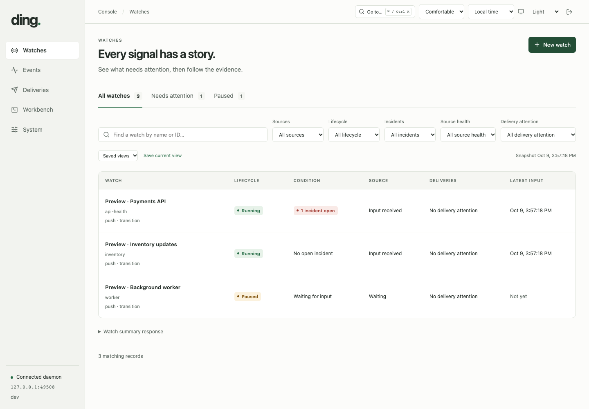
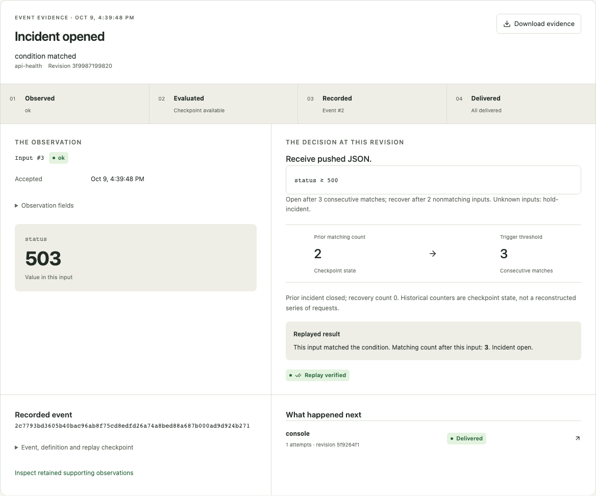

# Ding Console

Ding Console is available in **console-enabled source builds** from this checkout.
Published legacy v0.14.0 binaries do not include the Console or `ding ui`. Human
usability review and a fresh continuous soak remain release gates; see the
[qualification record](../development/console-qualification.md).

The interface follows the evidence: what was observed, how the condition was
evaluated, what event was recorded, and what happened to delivery. For a headless
installation, use the [first-watch CLI walkthrough](../guides/first-watch.md).

The console is served by the same daemon as the versioned API. Its browser session can inspect and manage that instance; the public `ding.ing` website is a separate deployment.

## Build and open

From a checkout, use Go 1.26+ and Node 24+:

```sh
make console
./ding daemon
```

In a second terminal using the same state directory:

```sh
./ding ui
```

`ding ui --no-open` prints a launch link instead of opening a browser. The link expires after 60 seconds and can be used once. Sessions expire after eight hours or when the daemon restarts. Log out using the console's top bar. The long-lived admin and ingest tokens remain on the daemon host.

`make headless` and ordinary `go build ./cmd/ding` require no Node installation. Console-enabled builds use `go build -tags console` after `npm run build` in `web/console`. The build fails if the embedded production assets are absent.

## Development

Run the daemon with `--ui-origin http://127.0.0.1:5173` and start `npm run dev` in `web/console`. The development proxy forwards `/v1` to `127.0.0.1:7676`; `ding ui` opens the configured development origin. Both hosts must match the configured origin exactly. A console-enabled daemon is required for session launch.

The console uses generated Go API contracts. After changing public Go response/request types, run `go run ./cmd/console-contract` from the repository root. Contract drift is a failing Go test.

## Remote deployment

An API deployment using `--allow-remote` can continue without browser access. To enable a console behind a TLS reverse proxy, configure `--ui-origin https://your-console.example` and preserve that Host header when forwarding requests. The origin must contain no path, query or fragment. The daemon does not trust forwarded headers to decide whether a browser request is secure. The proxy must enforce HTTPS and protect access to the underlying HTTP listener.

Launch links returned by `ding ui` use the configured origin. SameSite cookies, exact Host/Origin checks and per-session CSRF headers protect browser mutations. The separate ingest bearer credential is still required for producers. Never forward long-lived credentials in website URLs or frontend configuration.

## Preview

These screenshots use an isolated local fixture with clearly labeled preview watches.





For design and implementation status, see the [console plan](../development/console-plan.md) and [phase progress](../development/console-progress.md).

## Operating the console

Watches separates lifecycle, incident state, source health, and delivery problems. Its attention counts cover the entire store. Events starts newest first; **Follow live** announces new events without moving your place. A retention gap must be acknowledged by loading available history. Event evidence always uses that event's definition revision.

Workbench supports all YAML/JSON schema features. Compilation and JSONL simulation do not execute sources or send notifications. Review includes watches, destinations, permissions, missing environment references, and preserved/reset state. Apply checks the reviewed definitions atomically; conflicts preserve the draft for comparison. Drafts remain in memory across navigation and session reconnection, with explicit download and a page-close warning. They are not written to browser storage.

System includes full Doctor checks, current destinations, effective startup settings, help/completion downloads, and verified SQLite backups. Managed browser backup artifacts are limited to two outstanding files and 512 MiB each. They are private to the requesting session, single-use, and expire in five minutes; startup removes leftover artifacts. Collection/failure removes the file. Use **Save on daemon host** for larger snapshots; the existing absolute-path and no-overwrite guarantees apply. A backup contains operational data, not the separately stored daemon token files.

Legacy import reports unsupported features and required environment bindings and downloads a ZIP. It never applies a converted watch; opening a converted file in Workbench is a separate action. Starting/stopping the daemon process and changing startup flags remain host operations.

## Console checks

```sh
make test-console
DING_CONSOLE_SCALE=1 go test ./internal/watchrun -run TestConsoleScaleQualification -count=1 -v
```

Install browser engines once with `cd web/console && npx playwright install --with-deps`. The browser suite builds and exercises a real daemon with a separate temporary store for each test. Its local HTTP receiver provides deterministic delivery failures. No external provider credentials are needed.

An isolated Linux Firefox runner is also available:

```sh
docker build -f web/console/Dockerfile.test -t ding-console-browser-check .
docker run --rm ding-console-browser-check
```

Use `DING_VISUAL_CAPTURE=1 npx playwright test --project=chromium tests/visual.spec.ts` inside `web/console` to regenerate the documentation fixtures. Inspect the resulting screenshots before committing them. See the [qualification report](../development/console-qualification.md) for measured results and remaining release gates.
