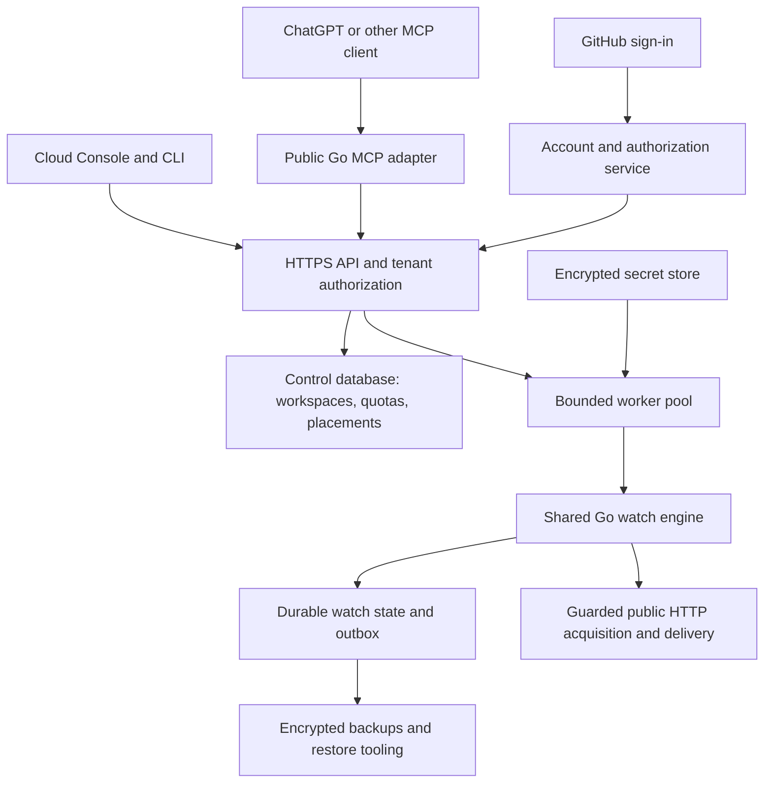

# Plan: optional Ding Cloud and a useful adoption funnel

Proposed October 10, 2026. Part of the [local-first roadmap](local-first-roadmap.md). **No hosted service, account flow, pricing, or spending is approved or implemented by this document.**

## Product promise and first scope

When a developer chooses **“Keep this watch running when my computer is off,”** Ding offers to run that eligible watch on infrastructure operated by Ding. Local use stays complete and free. Users with always-on machines can choose **“Run on my own server”** and remain account-free.

Start with public HTTP watches, one personal workspace per account, the existing deterministic evaluator, durable delivery, and a hosted version of the Console. Offer GitHub sign-in, no credit card, and no questionnaire. Support creating a watch directly in the cloud as a secondary entry point; a local installation must not be mandatory for someone arriving through a future cloud marketplace listing.

The first cloud version excludes arbitrary command execution, browser automation, laptop/private-network endpoints, customer code uploads, SMS, and model calls during checks. Webhook/Slack/Discord delivery reuses existing adapters with cloud egress policy. Incoming push/heartbeat sources are a later increment with separate producer credentials and quotas. Native desktop notifications alone are not a cloud delivery channel; the user must choose a destination that remains reachable while the computer is off.

## Funnel and experience

| Stage | User experience | Success signal |
| --- | --- | --- |
| Discover | README, website, releases, and supported marketplace listing explain free local use | Starts a supported installation |
| Activate locally | Setup starts a service, creates a useful watch, and verifies notification delivery | First real observation and test notification; demo excluded |
| Retain | Status is understandable; updates and restarts preserve watches | Useful watch still running at day 7/day 30 |
| Choose availability | Watch details show “Runs on this computer” and the explicit availability action | User voluntarily inspects execution options |
| Check eligibility | Local preflight explains source reachability, cadence, destinations, secrets, and cloud limits | Eligible selected watch; no account yet |
| Connect cloud | GitHub sign-in creates a personal workspace lazily | Auth completed or canceled without disrupting local execution |
| Review and move | Show selected configuration, data/secret transfer, execution location, limits, and any state reset | Confirmed transfer with cloud observations and destination test |
| Retain in cloud | Watch runs while the computer is offline; status and export remain accessible | Day 7/day 30 active hosted watch, reliable delivery, acceptable cost |
| Stay self-hosted / move back | Guided server setup or export/import with confirmed ownership handoff | Continued useful monitoring without a Ding Cloud dependency |

Do not put signup in the initial installer, gate local features behind login, or repeatedly prompt users who chose their own server. A monitoring gap can justify a factual availability explanation, but not a claim that an alert was missed without evidence. Keep cloud promotion out of alert payloads and incident notifications.

Preflight must run locally before uploading configuration. Reject or explain localhost/private URLs, command/file dependencies, unsupported features, incompatible cadence, absent remote delivery, and source credentials. A changed network observation point may change a service's response. Never silently rewrite a five-second local watch into a five-minute cloud watch.

## Identity and account creation

Use GitHub only for the minimum identity needed to create the workspace. Request no repository or organization access. Default to public identity without private-email scope; ask for additional contact information only if a later user-chosen capability requires it. Bind identity to GitHub's immutable user ID, not a mutable login or email. Use a maintained authentication implementation, validate OAuth state and callbacks, and revalidate identity on sign-in. See [GitHub's authorization flow](https://docs.github.com/en/apps/oauth-apps/building-oauth-apps/authorizing-oauth-apps) and [scope definitions](https://docs.github.com/en/apps/oauth-apps/building-oauth-apps/scopes-for-oauth-apps).

GitHub sign-in and MCP authorization are separate responsibilities. GitHub identifies the developer; Ding issues or delegates properly scoped authorization for the cloud API and model client. Do not use a GitHub access token as a Ding MCP bearer token. Implement the current host-required OAuth flow through a maintained authorization server/library, including PKCE, resource/audience binding, discovery, client registration as supported, short-lived access tokens, refresh/revocation, and real-provider tests. Reuse the adapter's existing token validation where applicable; that validation is not an account system or OAuth issuer. [OpenAI MCP authentication](https://developers.openai.com/plugins/build/auth).

Create a generated internal workspace ID and bind every API request, database operation, secret lookup, job, review, and receipt to it. Keep browser sessions, model-client grants, and source/destination credentials distinct. Signing out or disconnecting an MCP client should not silently stop watches; stopping execution and deleting an account are explicit operations.

## Hosted architecture in the monorepo

Proposed directories are `cmd/ding-cloud`, `internal/cloud`, and deployment/runbook files alongside existing integrations. Keep cloud-only dependencies and initialization out of `ding` and `ding-mcp` local builds. Reuse Console components and the tool contract, but implement a real multiuser authorization boundary; the existing local admin/session endpoints are not a public hosted API.

Use always-running Go execution workers. Merely hosting an MCP endpoint does not schedule or execute watches. Start with one region and a small managed deployment; avoid Kubernetes or multi-region consensus as prerequisites. Select a provider after measuring the runtime and operational requirements, not because it offers generic MCP hosting.

### C0 architecture spike: preserve correctness before optimizing scale

Benchmark a bounded worker pool with a single owner per tenant's SQLite state, persistent volumes, and explicit placement/fencing. Store accounts, quotas, and ownership metadata in a small shared control database; managed PostgreSQL is the initial candidate. Do not provision one VM per free account. Do not naively start an unbounded default worker pool for every account: the current runtime defaults to 32 acquisition workers and 8 delivery workers per app.

Before accepting this design, prove crash recovery, volume ownership, file-descriptor/memory bounds, tenant isolation, migration, and backup/restore. An expired database lease alone is not sufficient fencing: an old process must lose its ability to write or deliver before a replacement becomes active. Preserve at-least-once delivery semantics and stable delivery identifiers; do not promise exactly-once external webhooks.

If the SQLite placement model is operationally worse than a shared transactional store at the tested scale, perform a separate PostgreSQL store-adapter design and parity test. Do not rewrite condition evaluation or quietly relax ordering/outbox guarantees. Record measured capacity and the selected topology in an architecture decision before C1 deployment. Initial beta availability may use a controlled restart rather than unproven automatic failover; publish the actual recovery limitations.

### Cloud-specific controls required before beta

| Boundary | Required implementation |
| --- | --- |
| Tenant access | Derive workspace from authenticated identity/grant; object IDs never confer access. Test cross-tenant watches, evidence, reviews, exports, receipts, and UI caches. |
| Secrets | Encrypt per workspace with separate key management; resolve through an immutable tenant-aware provider. Never put tenant secrets in process-global environment variables. Redact logs, traces, tool results, and backups appropriately. |
| HTTP acquisition and delivery | Prevent SSRF through all source and destination paths: validate public destinations, resolve and enforce at connection time, handle IPv4/IPv6 and mapped addresses, block metadata/internal networks, control redirects, and prevent DNS rebinding bypasses. The current local HTTP adapter is not a sufficient cloud egress boundary. |
| Resource use | Bound cadence, request/body sizes, timeouts, retries, expression work, evidence bytes, outbox growth, concurrency, and per-destination/per-host traffic. Apply jitter and fair admission across tenants. |
| Execution policy | Reject commands, unsupported push ingestion, and private sources at every manifest/API/MCP entry point. Local capabilities remain available in local builds. |
| Durability | Fence writers, persist timer/outbox state, test kill/restart and restore, and define backup frequency plus measured recovery point/time. Include pinned evidence and WAL growth in storage accounting. |
| Public surface | Expose only authenticated cloud API, MCP, account/discovery routes, and the cloud Console. Keep local admin, filesystem, pairing, and backup-path operations private or unavailable. |
| Operations | Monitor scheduler lag, acquisition freshness, delivery age, disk/quota pressure, authorization errors, and restore success. Use an independent observer for cloud service health. |

## Proposed free beta and cost model

Start with **three public HTTP watches, a minimum five-minute interval, and seven days of detailed history** per account. These are hypotheses to test, not published entitlements. Also choose measured byte, request-size, retry, destination, and delivery limits before launch. Active incident evidence and pending deliveries may pin data beyond history retention; charge them against explicit storage limits and surface pressure instead of silently deleting required evidence.

Define what happens at every limit. Reject additional watches and intervals below the quota at creation/review time. Rate-limit abusive delivery patterns with visible status. Give advance notice for storage pressure and a recovery action. If safe operation requires stopping acquisition, show that state explicitly. Do not conceal missed checks behind a healthy badge. When the beta reaches the operating budget, restrict new enrollment rather than silently shutting off existing watches.

For 30 days, with every free account using all three watches at five-minute intervals:

| Active free accounts | Scheduled checks/month | Average checks/second |
| --- | ---: | ---: |
| 100 | 2,592,000 | 1 |
| 1,000 | 25,920,000 | 10 |
| 10,000 | 259,200,000 | 100 |

These are arithmetic workload estimates, not capacity or price estimates. Formula: accounts × watches × 30 × 24 × 60 ÷ interval minutes. A five-second interval would multiply this load by 60. Retries, deliveries, response sizes, evaluation cost, database writes, and backups add work. At ten requests/second, ten-second requests alone average roughly 100 in flight; concurrency must be measured as well as CPU.

Measure a realistic workload mix: fast/slow endpoints, timeouts, flapping incidents, large allowed responses, pinned evidence, delivery failures, idle accounts, and noisy tenants. Record CPU, memory, durable bytes per check, database/WAL growth, p95/p99 scheduler lag, bandwidth, and backup/restore time. Calculate monthly fixed infrastructure + execution + storage/backups + network + notification/auth/observability charges, with support and incident response tracked separately. Obtain current provider quotes at the deployment decision and test sensitivity to retention, cadence, and growth.

A **$200–500/month infrastructure envelope** is a planning proposal for a restricted beta, excluding engineering/support time. It is not a verified cost estimate or spending authorization. Begin with a capped cohort, such as 100 accounts; only expand after measured costs and service quality fit the approved budget. Establish cost per active account and per retained useful watch before offering more free capacity or finalizing a paid tier. Paid value can be more always-on watches, faster checks, longer hosted history, or team operation; do not remove existing local capabilities to create an upgrade incentive.

## Reversible transfer of selected watches

Implement a durable, idempotent transfer operation rather than a best-effort sequence of UI calls. V1 transfers configuration, explicitly selected destination settings, and separately approved secrets. It does not upload the local SQLite database or full history. Secret references are not secret values: ask the user to provide/rebind them through a protected form and never retrieve them through a model conversation.

1. **Preflight locally.** Check eligibility, running location, destination, account quota assumptions, and manifest revision. Show any required cadence/semantic change for review.
2. **Authenticate and prepare.** After the user chooses cloud, sign in and create a paused cloud watch. Store transfer ID, source instance/watch/revision, destination identity, and phase. Review exactly what leaves the machine.
3. **Validate from cloud.** After transfer consent, make a bounded source test and an explicitly labeled destination test. Show network differences. The local watch remains authoritative while these tests run.
4. **Freeze the handoff definition.** Bind the approved move to the current local revision/generation and destination revisions. Fail and re-review if the definition changed. Record how pending local deliveries will drain or be explicitly canceled.
5. **Pause local execution.** Confirm the pause and in-flight acquisition/delivery policy through the existing lifecycle guarantees. Only then activate the cloud watch using the transfer's idempotency key.
6. **Confirm cloud execution.** Wait for an actual cloud observation, show delivery-test evidence and the new running location, and mark the selected local watch as moved/paused. Leave other local watches untouched.
7. **Recover uncertain outcomes.** Persist phase on both sides. Query the cloud operation after a timeout; never resume local execution merely because the response was lost. If cloud execution is confirmed inactive, allow an explicit local resume. Prefer a visible unresolved move over silently running duplicate alert producers.

There is no atomic transaction across the laptop and cloud. Show the possibility of a short monitoring gap; preserve pending delivery records and provide a reconciliation view. For V1, start with healthy/idle watches and fresh cloud evaluation state. Moving an active incident/window requires a clear reset warning and an explicit choice, or postponement. Do not claim incident continuity or import raw runtime state until a separately versioned state-transfer protocol is designed.

Cloud sign-in cancellation never pauses local monitoring. A browser closed mid-transfer can resume the operation by ID. Moving back uses the same discipline: export/rebind credentials, prepare locally, confirm cloud pause, then resume local acquisition. Keep local history available; record provenance rather than pretending cloud observations occurred on the old machine. Account deletion includes export, explicit watch shutdown, credential revocation, and documented backup-retention behavior.

## Implementation milestones

| Milestone | Deliverable | Acceptance gate |
| --- | --- | --- |
| C0 decision and spike | Local pilot findings, marketplace outcome record, cloud demand interviews, resource benchmark, tenant/placement design, current vendor quote | Local release passes; product owner accepts the measured cost/recovery tradeoffs and beta budget before provisioning |
| C1 identity and isolation | Minimal GitHub sign-in, personal workspace, cloud API boundary, secrets, quotas, tenant-aware execution | Cross-tenant negative tests; no repository permission; account-free local binaries still work fully offline |
| C2 hosted execution | Public HTTP acquisition, safe egress, durable state/delivery, hosted Console, metrics, backups | Network adversarial tests, noisy-tenant tests, killed worker/restart/restore tests, sustained workload qualification |
| C3 transfer and funnel | Local eligibility UI, selected-watch review, durable move/recovery, destination test, export/move back | Laptop-off test, no-account-until-choice test, failures at every transfer phase, no hidden dual execution |
| C4 hosted MCP | Public TLS endpoint, real OAuth provider/issuer integration, existing tools/UI with workspace authorization | Actual ChatGPT client, PKCE/refresh/revoke, concurrent identity isolation, reviewed mutations, synthetic reviewer workspace |
| C5 limited release and expansion | Capped free beta, documented limits, privacy/support/recovery runbooks, official plugin submission when eligible | Retention and cost targets reviewed after the first cohort; named operational owner and tested incident response |

The C0 outcome must explicitly distinguish a marketplace restriction from evidence of customer demand for cloud. C1–C4 build a usable hosted product before public distribution is promised. C4 can reuse most transport/tool work, but live identity, multi-tenancy, and host qualification are new work. Public submission follows the current [OpenAI review requirements](https://developers.openai.com/plugins/deploy/app-review); approval remains external.

## Measurement without compromising local adoption

The primary metric is retained developers with a useful watch, split by local, user-hosted, and cloud execution. Local analytics are optional and off by default; never require an account to count activation. Use observed usability sessions and an explicitly opt-in cohort for local retention. Label selection bias and do not present download counts as verified active users.

Cloud may collect the operational metrics needed to run the service, with disclosed retention. Product analytics must not include watched URLs, command text, payloads, secrets, or model transcripts. Do not fingerprint local users or silently join anonymous local activity to a later GitHub identity.

Track the steps independently: installation started/completed, service ready, first real watch observed, notification test confirmed, day 7/day 30 local retention where measurable, availability action selected, eligibility result, sign-in started/completed/canceled, transfer started/completed/recovered, first hosted observation, day 7/day 30 cloud retention, delivery reliability, cost per retained watch, and moves back to self-hosting. A GitHub signup is not activation.

Initial usability targets are the local five-minute goal and a cloud move within two minutes when no new destination credentials are needed. Treat both as hypotheses tested with real users. Measure conversion from voluntary availability interest to retained hosted use; do not invent a required signup conversion rate before seeing a cohort. Interview users who stay local or cancel sign-in so adoption and account aversion remain visible.

## Launch gates

Before inviting the first cloud users: run a sustained 72-hour representative workload, demonstrate tenant isolation and bounded costs, restore a backup on a fresh worker, test outages and quota states, and complete real-device transfer with the source computer offline. Define and publish the beta's actual support boundaries and measured recovery point/time; do not advertise an uptime SLA from a short soak.

Before expanding beyond the capped cohort: inspect at least one meaningful retention window, measured unit costs, authentication/transfer abandonment, support burden, and operational incidents. Fix loss of useful monitoring before optimizing signup counts. Before broad marketplace release: pass the applicable official review and repeat clean-account onboarding on the advertised surfaces.

The product decision remains reversible: Ding's manifest, evaluator, local UI, exports, and self-hosted execution stay useful independently of cloud availability or a future pricing decision.
