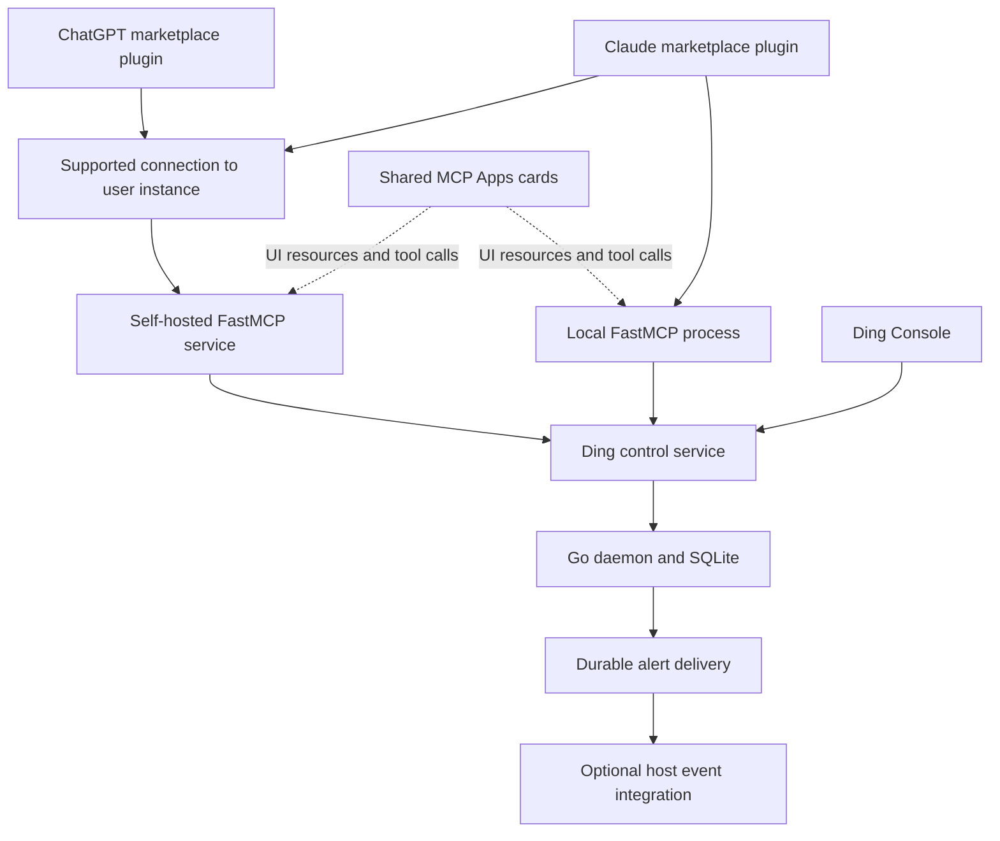

# Ding integration plan for ChatGPT and Claude

Proposed October 9, 2026. Scope: local and self-hosted Ding, distributed through the official ChatGPT and Claude marketplaces. Implementation started October 10; see the [integration guide](../integrations/README.md) and [release qualification status](../integrations/release.md). Publication remains a separate external milestone.

The [Go MCP adapter migration plan](mcp-go-migration-plan.md), proposed October 10,
supersedes the Python/FastMCP implementation direction below. The current adapter
still uses FastMCP; the migration has not been implemented. Product and marketplace
requirements in this plan continue to apply.

Build one Ding MCP implementation in Python with FastMCP, package it with workflow skills for each platform, and add a shared MCP Apps interface for the moments when people need to inspect or approve something. Keep the Go daemon responsible for acquisition, evaluation, persistence, and delivery. The model helps people define and understand watches; Ding keeps running independently of the conversation.

The intended experience is: install Ding from the marketplace, connect a local or self-hosted instance through supported setup, describe a watch, inspect its preview, activate it, and later investigate an alert with its actual evidence. Marketplace publication and a polished connection flow are release requirements. A manually configured connector is useful for development but does not satisfy this product requirement.

## Product decisions

| Decision | Proposed direction |
| --- | --- |
| Integration foundation | One Python FastMCP server and tool contract, shared across clients |
| Distribution | Official marketplace plugins containing MCP integration, skills, onboarding, and branded assets |
| Execution and storage | User-controlled Ding daemon and SQLite state |
| Ding-operated infrastructure | None under the current self-hosted-only constraint; a connection relay would require a separate product decision |
| Interface | Conversation plus focused embedded cards; full Ding Console for extensive inspection and editing |
| Models | Use the host's selected model; do not require a separate model API key for ordinary watch operations |
| Background work | The daemon owns monitoring; platform event integrations are optional destinations |
| Initial user | A developer or small team already using Ding on a workstation or their own server |
| First workflows | HTTP health, missing pushed data, changed values, and alert investigation |

Self-hosting controls where Ding executes and retains its authoritative state. Information returned to ChatGPT or Claude still reaches the selected model provider. Explain that during connection setup and expose only the selected instance and permitted records.

## Marketplace feasibility comes first

Both platforms now describe plugins built from skills and MCP servers, with optional MCP Apps UI. The portable part is the tool and UI contract; installation, execution environments, and publication requirements still differ. [OpenAI plugin architecture](https://developers.openai.com/plugins/concepts/plugins), [Claude plugin overview](https://claude.com/docs/build/overview).

| Target surface | Current documented route | Consequence for Ding |
| --- | --- | --- |
| Claude Cowork on the user's computer and Claude Code | A marketplace plugin can include a local MCP server | Strongest documented first target for the strict self-hosted product |
| Ordinary Claude chat, including desktop chat and browser | Plugin remote MCP connections work; bundled local servers are ignored | Requires a supported remote connection to the user's instance |
| ChatGPT public marketplace | Standard MCP submissions use a public HTTPS endpoint; template URLs are restricted to established trusted developers | Resolve official local support or approved instance-specific routing before promising a universal self-hosted listing |
| ChatGPT custom connections | Public HTTPS or Secure MCP Tunnel | Useful for interoperability testing; does not establish marketplace eligibility |

Claude's feature matrix also says chat ignores MCP URLs containing `${user_config.*}`. A text box asking for a self-hosted URL cannot simply be assumed to work inside a published chat plugin. Its current directory guide directs local MCP servers into plugin bundles and deprecates new standalone desktop-extension listings. This is more specific to new submissions than older help-center instructions describing an extension submission form. [Claude platform support](https://claude.com/docs/plugins/platform-support), [Claude directory publishing](https://claude.com/docs/directory/publish).

OpenAI explicitly instructs developers unable to deploy a public endpoint to contact it about local MCP support. Its review guide describes template endpoints, but does not establish general access for a new publisher or arbitrary customer-owned domains. [OpenAI packaging](https://developers.openai.com/plugins/build/plugins), [MCP review requirements](https://developers.openai.com/plugins/deploy/app-review).

**Milestone zero must resolve these questions with platform-supported behavior and, where necessary, a written publisher response:**

1. Can Ding publish a local MCP plugin in ChatGPT with the desired supported surfaces?
2. Can a public listing bind to a user-owned instance or secure tunnel during installation, without requiring a separate custom connector?
3. Which instance URL patterns, OAuth configurations, and publisher domain checks are accepted?
4. For Claude, can a directory plugin connect to arbitrary self-hosted instances in chat through a supported installation mechanism? Can the local package provide an equally polished Cowork setup?
5. Which embedded UI and event features are supported on each accepted route?

Prepare a small working server, tool inventory, proposed installation screens, and a synthetic-data review instance for those discussions. Do not send outreach or submit anything as part of this planning task.

If official self-hosted routing is unavailable, ship the supported local Claude plugin first and hold the affected browser/ChatGPT release. A Ding-operated relay could make a single public endpoint practical, but changes the infrastructure constraint: it would process tool traffic even if watches and storage remain local. It is an explicit alternative, not an assumed implementation detail. A skills-only listing that requires manual connector setup is not the requested finished product.

## What Ding already provides

The current repository provides a substantial base, although the watch runtime is still labeled preview and console release gates remain open.

| Existing component | Reuse in the integration |
| --- | --- |
| `internal/watchrun` and `internal/store` | Durable watch state, events, evidence, lifecycle, and delivery outbox |
| `internal/plan` and `internal/replay` | Authoritative validation, deterministic explanations, fixtures, and evidence verification |
| `internal/control` | Versioned API, structured errors, bounded read models, compile/test/replay operations |
| `internal/watchrun/review.go` | Apply review bound to the instance, exact manifest, watch lifecycle state, and destination revisions |
| `web/console` | React components, visual tokens, evidence presentation, and generated TypeScript contracts |
| `skills/ding-watch` | Supported semantics, authoring workflow, and rules for honest capability handling |

See the [API](../api.md), [console architecture](console-architecture.md), [console progress](console-progress.md), and [existing watch skill](../../skills/ding-watch/SKILL.md).

The missing work is MCP transport and presentation, client packages, polished installation, connection authorization, scoped grants, durable mutation receipts, and optional event subscriptions. The existing admin/ingest bearer split is not an OAuth implementation or a per-client permission system. Do not present those proposed capabilities as already implemented.

## Architecture



Implement the adapter in Python using the standalone `fastmcp` package, as requested. Use FastMCP 4 as the starting baseline: its GA announcement documents support for protocol `2026-07-28` and compatibility with older clients. Pin an exact tested release and its dependencies when implementation starts. [FastMCP 4 announcement](https://blog.gofastmcp.com/3mufbh2vcv22o).

Define a proposed `ding-mcp` executable with stdio and opt-in HTTP modes using FastMCP's transports. A `ding mcp` convenience launcher may locate the packaged adapter, but the server implementation remains FastMCP. The Go runtime remains independently installable; the complete plugin installation additionally includes an isolated Python runtime and locked dependencies. No system Python, `pip install`, development environment, or runtime dependency downloads should be required from end users. [FastMCP transports](https://gofastmcp.com/deployment/running-server).

The stdio process connects to the existing daemon through the local control API. It does not start another evaluator, independently open the state database, or stop watches when its host conversation closes. Send protocol output to stdout and operational logs to stderr. A missing daemon produces an actionable connection state; installation and service startup belong to the setup flow.

The HTTP adapter uses the same tool handlers, served on a separately controlled listener or route boundary. Make only the intended MCP and authentication discovery endpoints externally reachable. Do not expose the admin API, ingest credentials, backups, or browser handoff endpoints as a side effect of enabling MCP.

For both modes, delegate domain work over the daemon's versioned control API using a bounded asynchronous HTTP client. Python cannot directly reuse Go internal functions; expose any missing operations through the Go service/API layer instead. Do not copy condition evaluation, YAML validation, or review logic into Python. Define explicit typed FastMCP tools and Pydantic result models, with contract fixtures generated or checked against Go structures. Do not automatically publish every control API route as an MCP tool.

Use FastMCP lifespan management for the daemon connection pool, request timeouts, and cleanup. Keep connection state scoped to the authenticated instance/principal; never use a process-global mutable current user or current instance. Use FastMCP's test client for protocol and tool tests, followed by real-host tests. Pin Python and transitive dependencies in a lockfile and package prebuilt UI assets with the Python distribution. Operate the service locally or on user-owned infrastructure; FastMCP's hosted deployment products are not required.

Target protocol `2026-07-28` with explicit compatibility testing for earlier clients. The current MCP core uses stateless requests and per-request capability negotiation; capabilities such as UI remain negotiated extensions. Maintain host capability detection rather than inferring features from a client name. [MCP specification](https://modelcontextprotocol.io/specification/2026-07-28).

An externally reachable deployment remains entirely user-operated. Document a supported HTTPS/auth deployment recipe once the marketplace route is approved. OpenAI Secure MCP Tunnel is a separate supported private connection option requiring its own client and platform permissions; it does not by itself solve public directory distribution. [Secure MCP Tunnel](https://developers.openai.com/api/docs/guides/secure-mcp-tunnels), [ChatGPT connection testing](https://developers.openai.com/plugins/deploy/connect-chatgpt).

## User journeys

**Create a watch.** “Check my health endpoint every five seconds. Alert after three failures and clear after two healthy checks.” The plugin discovers the connected instance's capabilities and available destinations, constructs a supported manifest, compiles it, and runs a small fixture. It shows the source, interval, exact firing/recovery semantics, destination, missing credentials, and effects on existing state. Activation uses the exact reviewed definition and returns committed state. A new watch is shown as waiting for input until actual observations arrive.

**Understand an alert.** “Why did the payments watch fire?” The model retrieves the event-time definition and retained evidence, explains which observation crossed which condition, and separates event creation from notification delivery. The evidence card shows a short chronology and verification status. A history gap stays visible.

**Change behavior.** “Make this less noisy.” The model identifies the relevant watch, proposes a concrete change, simulates it, and shows the state preservation/reset consequences before applying. A revision conflict triggers a fresh comparison. It never silently overwrites another client’s edit.

**Manage a watch.** “Pause this until I finish maintenance.” Pause is supported. A timed resume must be identified as a separate feature unless Ding implements it; do not manufacture a deadline or rely on the chat remaining open. Resume, delete, and retry have distinct effects and distinct tool descriptions.

**Diagnose delivery.** “The alert fired but Slack never received it.” Inspect the retained destination revision and attempt history. Explain whether credentials, receiver response, retry scheduling, or exhaustion caused the issue. Retry only eligible work and disclose possible duplicate remote delivery.

**Use an unsupported source.** A request about flights, prices, or arbitrary webpages does not imply Ding has a feed or browser polling adapter. Identify the actual source and credentials required. The plugin can draft a watch only when supported inputs and semantics exist.

## Tool contract

Use a small vocabulary of explicit tools. The names below are proposed. Avoid a generic shell tool, generic HTTP proxy, or a tool that accepts an arbitrary internal API path.

| Tool or group | Contract |
| --- | --- |
| `ding_get_capabilities` | Instance identity, runtime/API version, allowed operations, source/condition support, connection health, limits, and UI/event support |
| `ding_list_watches`, `ding_get_watch` | Bounded current state; separate lifecycle, condition, source health, and freshness |
| `ding_list_events`, `ding_get_event` | Stable IDs, retained chronology, event-time definition and bounded evidence; explicit history gaps |
| `ding_list_deliveries`, `ding_get_delivery` | Event-linked delivery status and attempt history |
| `ding_list_destinations` | Existing named destinations and credential presence; no resolved URLs or secrets where sensitive |
| `ding_preview_changes` | Validate a manifest bundle, explain semantics, optionally test fixtures, and produce the daemon's dry-run comparison |
| `ding_apply_changes` | Apply the reviewed bundle with revision preconditions and an operation key |
| `ding_pause_watch`, `ding_resume_watch` | Separate scoped lifecycle actions with expected revision/state |
| `ding_delete_watch` | Explicit retention/queue semantics and a required cancel-pending choice |
| `ding_retry_delivery` | Eligible terminal work only; original event/destination semantics |
| `ding_get_operation` | Reconcile a lost mutation response without repeating its effects |

Start with reads, preview/apply, and pause/resume. Add delete and manual retry after the mutation and authorization tests pass. Keep diagnostics, exports, and deep evidence available through bounded detail operations and Console; backup paths and credential administration do not belong in the initial model-facing catalog.

Every tool needs a purpose-specific description, bounded JSON input/output schemas, examples, stable error codes, and truthful read/write/destructive/external-action annotations. Describe indirect consequences: applying a watch can start command execution and future outbound notifications. An annotation is guidance for the host, not an authorization check.

Return a concise model-readable result plus structured data. Include the relevant ID, revision, timestamp, actual status, next cursor, and completeness indicators. Keep routine list responses small; request raw observations and large evidence only on demand. An empty page differs from a disconnected daemon, unsupported operation, or expired cursor.

Publish the supported manifest schema and a few tested templates as resources. Bundle key workflow guidance as skills so clients that do not consume prompts/resources still work. Core tools must remain usable with the embedded UI disabled.

## Reliable and authorized mutations

Build on the existing whole-bundle review preconditions. A preview response should carry an opaque, expiring review handle bound to the authenticated principal, instance, exact manifest, and comparison. The handle proves what was reviewed, not that a human authorized execution.

The apply handler resolves that handle, checks the caller's grant and applicable host/user authorization, then checks the original preconditions in the same transaction as the mutation. Editing a draft invalidates its previous review. Destination edits receive the same protection as watch edits. Preserve already-given user authorization instead of adding repeated confirmation prompts for every step.

Add durable operation receipts to the daemon. Bind each operation key to principal, instance, action, and request digest; commit the receipt together with the state change. A matching retry returns the stored outcome. Reusing a key for different content fails. Publish receipt retention and the reconciliation procedure after expiry. Current ingestion receipts do not establish idempotency for apply, lifecycle, or manual retry.

Retain an audit trail of client identity, operation, target, revision, and outcome. Avoid raw credentials and unnecessary observation payloads in logs. A successful mutation says what committed; it does not claim the source has already responded, a notification was seen, or a downstream model completed work.

## Permissions and connection security

Begin with a single-instance model. Add per-client grants such as inspect, preview, manage watches, and retry deliveries, with optional watch/destination restrictions. Keep local administrator authority distinct from plugin authority. A remote model should not obtain full admin access merely because the adapter uses a local connection underneath.

For stdio, keep credentials in the user's protected Ding configuration and pass only a scoped connection into the adapter. For remote access, use FastMCP's authentication abstractions with a maintained authorization-server implementation or the user's identity provider. Configure explicit HTTP authentication: FastMCP's default is unauthenticated. A token verifier alone is not a complete OAuth discovery/login flow. Select and qualify the appropriate remote-auth or OAuth-proxy integration, and use persistent protected auth storage where required. [FastMCP authentication](https://gofastmcp.com/servers/auth/authentication).

Do not invent a custom OAuth protocol. Verify issuer, audience/resource, expiry, scopes, and revocation; test discovery, client registration, PKCE, reconnect, and auth failures in each target host. [OpenAI authentication](https://developers.openai.com/plugins/build/auth), [Claude connector authentication](https://claude.com/docs/connectors/building/authentication).

Never ask users to paste provider secrets into chat. Configure environment references and destinations through Ding's trusted setup/Console path; the model sees only names and presence. Review handles and callback secrets must not become chat-visible URLs.

Command watches already run as the daemon user without a sandbox. Disable plugin creation or alteration of arbitrary command sources by default. Permit explicitly configured command templates through a separate local policy, with executable, argv constraints, working directory, environment references, timeout, and resource bounds. Pure compilation/testing must not execute a command or fetch a source.

For HTTP watches, preserve intentional access to user-owned private services through explicit instance policy. Apply destination restrictions and redirect/DNS checks where an untrusted client could otherwise use the daemon as a network proxy. Callback URLs for platform events require their own public-address validation; a private health-check source does not justify allowing private event callback targets.

Treat observation text, source responses, and notification content as untrusted data throughout retrieval and UI rendering. They cannot authorize new watches, redirect delivery, run commands, or override tool policy. Bound field sizes and render text safely.

## Embedded UI

Build three shared React views using MCP Apps: a watch card, a change preview, and an event evidence card. Both vendors document support for the shared UI standard. Use a small host adapter for any additional capabilities and retain textual results for unsupported hosts. [ChatGPT UI quickstart](https://developers.openai.com/plugins/build/app-quickstart), [Claude MCP Apps](https://claude.com/docs/connectors/building/mcp-apps/getting-started).

| View | What belongs inside the conversation |
| --- | --- |
| Watch card | Name, instance, lifecycle, condition, freshness, latest event, permitted controls, and Open in Ding |
| Change preview | Plain-language behavior, selected source/destination, fixture timeline, definition changes, state consequences, and activation result |
| Event evidence | Observation → condition → event → delivery, event-time revision, replay status, retained history gaps, and inspection links |

Reuse Console design tokens, formatting, status vocabulary, and suitable presentational components. Build a separate small UI bundle and data adapter, served through FastMCP's custom HTML MCP Apps path. This allows the existing React design to carry over while FastMCP handles the server. Use fixed, tested views for the initial product rather than model-generated interface code. [FastMCP custom HTML apps](https://gofastmcp.com/apps/low-level).

The current Console deliberately sends `X-Frame-Options: DENY` and `frame-ancestors 'none'` and uses same-origin authenticated sessions. Do not remove those protections or embed the full `/ui/` application in a chat iframe. [Current browser boundary](console-architecture.md), [static serving implementation](../../internal/webui/serve.go).

Use the MCP Apps bridge for tool calls and host context. Keep authoritative data and grants on the server; component state is only presentation state. Respect the host's dimensions, theme, keyboard behavior, reduced motion, and refresh capabilities. Label stale snapshots. An old card may require refetch and a fresh review before its action can proceed.

Open in Ding links should target the exact watch/event route and use the user's configured Console origin. If login is required, preserve the intended route through the existing safe authentication flow. Do not put admin tokens, manifests, or handoff credentials in model-readable links. Explain when a link is reachable only from the user's local network; never substitute the cloud executor's localhost.

The full Console remains the place for large histories, extensive YAML editing, destination/credential configuration, diagnostics, and backup. Browser automation is an optional user workflow, not the integration's control transport.

## Skills and model quality

Evolve the existing watch skill into shared source material for four concise workflows: connect/setup, create/change a watch, investigate an event, and diagnose delivery. Generate or package platform-specific tool-name references from that common material rather than maintaining divergent instructions.

Teach the model to discover capabilities, identify a real source, preserve typed conditions and unknown-input behavior, compile/test, inspect the comparison, apply within authorization, and verify committed state. It must distinguish durable monitoring from reminders, general agents, and trading/execution requests. It should say which missing input is necessary without repeatedly asking about choices the user has already supplied.

Evaluate the host's current leading models and at least one faster available model in each ecosystem. Pin model/client versions in the evaluation records. Optimize schemas, examples, descriptions, and workflow clarity using observed failures; do not require one model name or fine-tuning to operate Ding. Model upgrades should not require daemon changes.

## Background alerts and agent follow-up

The portable baseline is Ding's existing console, webhook, Slack, and Discord delivery plus later evidence retrieval through MCP. Closing a chat must not stop the daemon. Laptop sleep or a stopped daemon still interrupts acquisition; recommend an always-on user-owned host for continuous monitoring. FastMCP background tasks are a separate optional mechanism for long-running tool calls; they must not replace Ding's persistent evaluator or outbox. Do not introduce a second scheduler or task broker for routine watches.

ChatGPT documents an optional MCP Events integration for Work chats on web, desktop Work with Cloud selected, and dots. It requires protocol `2026-07-28` and uses verified signed webhooks. This is a promising way for a firing watch to trigger authorized follow-up in an eligible chat. It is not a promise of event support in all ChatGPT surfaces or Claude chat. [ChatGPT MCP Events](https://developers.openai.com/plugins/build/mcp-events).

Proposed Ding event work, implemented as a thin FastMCP extension backed by daemon services if the pinned release does not already provide the required host-compatible extension:

- Expose firing/recovered event types first; add source-health and terminal-delivery events only where the runtime has durable evidence for them.
- Store subscriptions, owner/grants, filters, expiry, and protected signing material durably. Recheck access on delivery and stop on revocation or expiry.
- Use the daemon outbox/service boundary to commit subscription delivery intents with committed events, or use a durable sequenced dispatcher with explicit replay guarantees. The MCP process must not own an ephemeral notification queue.
- Keep an immutable event ID across retries, inspectable attempts, and a bounded replay cursor. Handle out-of-order events and report retention gaps.
- Verify callbacks before application delivery, sign requests, bound retries, and distinguish callback acceptance from downstream task completion. Implement current host limits and response rules as versioned compatibility tests.
- Keep subscribe/unsubscribe separate from creating or deleting a watch. Disable an integration without deleting monitoring state. Prevent loops where follow-up edits generate unlimited new agent work.

For Claude, qualify any future documented event-trigger mechanism independently. Protocol notifications or a long-running tool call are not evidence that a closed chat will wake up. Scheduled host checks can be documented where supported, but they do not replace Ding's continuous evaluator or satisfy an event-driven guarantee.

## Installation and marketplace deliverables

The target installation flow is discover → install → connect instance → choose permissions → run a sample preview → ready. It should not require editing JSON, copying bearer tokens, running an unpinned package with `npx`, or keeping a terminal window open. The connection route and any required native installation must be supported by the host and the operating system.

For local use, prepare a signed Ding installer/service integration or an approved bundled-runtime approach. Detect an existing installation, version, state directory, and running daemon safely. Present an instance selector when necessary. Do not silently create a second daemon or migrate state during plugin installation. Use supported package locations; Claude rejects top-level `bin/` in chat/Cowork plugin packages. [Claude plugin structure](https://claude.com/docs/plugins/build).

For self-hosted servers, guide the owner through the approved connection flow and show connection health in Console. Shipping a signed binary does not eliminate the need for the owner to configure a reachable endpoint or supported private connection.

Produce these release artifacts from one versioned source:

| Deliverable | Contents and acceptance |
| --- | --- |
| Shared MCP implementation | Python FastMCP adapter, typed tools, capability negotiation, scoped daemon client, locked runtime, diagnostics |
| Shared UI assets | Versioned watch/preview/evidence resources, exact CSP, light/dark and accessible layouts |
| ChatGPT plugin | Current supported package format, skills, onboarding, approved MCP route, publisher/listing assets, review cases |
| Claude plugin | `.claude-plugin/plugin.json`, MCP configuration, skills, README/license, approved local/remote dependencies |
| Installation assets | Signed native artifacts, supported background service lifecycle, upgrade/uninstall/recovery flow |
| Publisher materials | Identity, brand assets, screenshots, demo, support/privacy URLs, data-flow explanation, changelog |
| Review environment | Separate synthetic data, repeatable firing/recovery examples, nonproduction credentials, reset procedure |

Use the public ChatGPT submission portal and Claude's official directory process. For a Claude remote route, its documentation calls for a connector submission alongside the plugin bundle. Do not label a repository marketplace or local ZIP as an official listing. [OpenAI submission](https://developers.openai.com/plugins/deploy/submission), [Claude publishing](https://claude.com/docs/directory/publish).

Uninstall should revoke the plugin's connection and event subscriptions while leaving the user's watches and retained state under their control. Upgrades preserve state and support rollback where schema compatibility allows it. A plugin/daemon version mismatch must explain the required action before allowing incompatible writes.

## Implementation work and dependencies

| Phase | Work | Exit criterion | Planning allowance |
| --- | --- | --- | --- |
| P0 Marketplace feasibility | Minimal server/UI spike; verify local bundle installation; prepare publisher questions and reviewable connection designs | A documented accepted route for each claimed launch surface; unresolved surfaces explicitly held | 3–5 engineering days, plus external responses |
| P1 Shared MCP foundation | FastMCP stdio/HTTP modes, typed daemon client, read tools, capabilities, schemas, errors, bounded results, fixture harness | Real daemon inspected correctly from target hosts; headless fallback works | 4–7 days |
| P2 Authoring and control | Preview/apply, scoped grants, durable receipts, lifecycle, skill workflows | Concurrent edits, lost responses, and restarts reconcile without duplicate mutations | 5–8 days |
| P3 Product experience | Shared cards, Console links, native setup, daemon discovery, permission management | Clean-machine install through the approved package; first watch without manual configuration | 6–10 days |
| P4 Remote self-hosted connection | Approved instance routing, OAuth, HTTPS deployment, reconnect/revocation | Accepted marketplace route works against two independently operated instances | 5–10 days if the platform route exists |
| P5 Background integration | Subscription storage, event delivery, replay, host-specific controls | Fire and recover with chat closed; verify eligible host behavior and fallback | 4–7 days |
| P6 Publication and qualification | Real-host evals, security/reliability tests, installation matrix, documentation, review submissions | Marketplace approval, published listings, and clean install from those listings | 4–7 days plus review time |

For one experienced engineer with design/QA support, allow roughly 6–10 engineering weeks for the supported core product, and roughly 8–12 weeks including remote connection and events. These are estimates, not elapsed-time commitments; publisher approval, endpoint-routing support, native signing, and outstanding Ding release gates can dominate the calendar. Re-estimate after P0. A relay service is outside this estimate and scope.

P1 and most of P2 are useful regardless of marketplace outcomes. Do not invest in elaborate host-specific onboarding until P0 establishes the route. P3 depends on stable results and mutation behavior. P4 and P5 are separately gated; a local Claude release can precede them without claiming browser parity. P6 includes the platform-specific release gate for every advertised surface.

Suggested repository ownership:

```text
integrations/mcp/         Python FastMCP project, pyproject.toml, lockfile, tests
integrations/mcp/src/     typed tools, daemon client, auth, UI resources, extensions
internal/control/         scoped adapter access and reusable operation services
internal/watchrun/        authoritative mutation/review/operation behavior
internal/store/           grants, receipts, optional subscriptions and delivery state
internal/watchcli/        optional adapter launcher and setup diagnostics
web/mcp-app/              compact shared UI and host bridge
web/console/              reusable visual components and connection settings
plugins/chatgpt/          generated/validated ChatGPT release package
plugins/claude/           generated/validated Claude release package
skills/ding-watch/        shared supported authoring guidance
testdata/mcp/             protocol fixtures and semantic evaluation cases
docs/integrations/        published client setup and compatibility matrix
```

These paths are proposed additions except where the repository already contains them. Extract a shared frontend package only when reuse warrants it; avoid restructuring the Console just to ship the first three cards.

## Qualification and release gates

Maintain a dated matrix of host, operating system, execution mode, account/workspace policy, plugin version, daemon version, transport, UI support, and event support. Test actual marketplace installations; MCP Inspector success alone is insufficient.

| Area | Required evidence |
| --- | --- |
| Semantic accuracy | Natural-language requests produce the intended source, type, interval, consecutive/recovery rules, destination, and state behavior |
| Unsupported requests | No invented providers, percentage operators, timed resumes, autonomous actions, or event delivery guarantees |
| Authorization | Restricted reads/writes fail; destination and command permissions cannot be bypassed through preview or UI calls |
| Mutation integrity | Concurrent ChatGPT/Claude edits, destination-only changes, changed drafts, dropped responses, repeated operation keys, and daemon restart |
| Evidence integrity | Event-time definitions, unknown-input handling, incomplete pages, missing checkpoints, expired cursors, and retention gaps |
| Installation | Clean supported machines, existing Ding versions, multiple instances, missing daemon, reconnect, update, uninstall, and rollback |
| UI | Light/dark, keyboard and screen reader use, small widths, stale cards, rejected permissions, revoked sessions, and disabled UI |
| Network security | Auth expiry/revocation, audience mismatch, redirect/DNS handling, malicious callback/source fields, and private-network policy |
| Event integration | Duplicate and out-of-order delivery, restart recovery, expired subscriptions, revoked access, receiver rejection, and bounded follow-up |
| Supply chain | Pinned dependencies, signed/checksummed release artifacts, secret scans, and reproducible package contents |

Start with a focused set of about 30–50 scenario fixtures, including paraphrases and negative cases. Proposed release targets: all deterministic integrity/security cases pass; at least 95% correct completion on supported, fully specified semantic cases in the recorded model matrix; zero unsupported actions or unauthorized writes in the release suite. Report the sample and failures rather than treating a small evaluation set as a universal reliability claim.

Measure time to connect and create a first watch, time to explain a firing event, unnecessary clarification frequency, tool calls/tokens per completed workflow, connection failure rate, and successful upgrades. Target a first watch in under five minutes after Ding is installed and an endpoint explanation in one short interaction. Keep aggregate metrics local by default; any opt-in diagnostics must exclude secret and observation content.

Before publication, complete the watch/console release qualifications that the integration depends on. Before announcing a surface, install the published plugin on a clean account, connect a real self-hosted instance through the supported route, create and change a watch, close the chat, produce a firing and recovery event, and inspect its retained evidence. Announce only the surfaces that pass.

## Recommended starting scope

Proceed with a shared Python FastMCP adapter, the existing Go runtime and authoring semantics, and three compact UI views. Make marketplace feasibility and supported self-hosted onboarding the first deliverable. Target the documented local Claude plugin route first while resolving official ChatGPT and browser connection support. Keep browser Console access as a useful companion and fallback for large workflows, never as a substitute for the promised plugin.

The first complete demonstration should create an HTTP health watch in conversation, show a truthful preview, activate it with concurrency protection, survive closing the client, and explain a real firing and recovery from stored evidence. That demonstrates why Ding belongs beside a frontier model and tests the whole product boundary in one small workflow.
