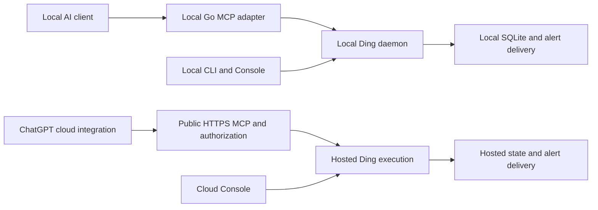

# Local Ding, marketplace distribution, and optional Ding Cloud

Proposed October 10, 2026. **Implementation plan, not a description of shipped features.**

Make Ding a complete, free developer tool on the user's machine. Earn adoption through a useful first watch, reliable operation, and a good local MCP experience. Offer hosted execution when someone chooses **“Keep this watch running when my computer is off.”** Keeping Ding on a personal server is an equally successful outcome.

This roadmap expands the original [integration plan](llm-integration-plan.md): local remains the default, and an optional cloud product is now in scope for planning. It does not authorize infrastructure spending or claim marketplace approval.

## Product decisions

| Area | Decision |
| --- | --- |
| Repository | Keep the runtime, official Go SDK MCP adapter, installers, Console, plugins, and future cloud service in this monorepo. Share contracts and evaluation code; keep cloud identity and billing outside the local execution path. |
| Local product | No Ding account, payment, compiler, Python, Node, model API key, or required telemetry. CLI and Console work without an LLM. Model-host access and pricing remain the user's choice. |
| Local integration | The desktop host launches a local MCP adapter, which calls the local daemon. The daemon continues after the conversation and host app close. No Ding-operated public relay. |
| Self-hosting | Support always-on Mac minis, Linux machines, and user-operated servers. Preserve command sources, local/private endpoints, exports, and version pinning. No artificial cloud conversion requirement. |
| Cloud value | Ding operates the machine that checks and delivers alerts. Cloud MCP accesses that hosted execution directly; it does not forward requests back to a sleeping laptop. |
| Account timing | Check watch eligibility locally first. Ask for GitHub sign-in only after the user chooses hosted execution. No credit card or onboarding questionnaire for the proposed free tier. |
| Distribution | Qualify official desktop-only marketplace distribution separately from local MCP compatibility. A manually configured connector does not satisfy the marketplace goal. |
| Success | Developers retain useful watches. Local and self-hosted retention count as success alongside optional cloud adoption. |

## Three execution locations

| Location shown to the user | Runs while the laptop is off? | Ding account? | Source access |
| --- | --- | --- | --- |
| This computer | No | No | Endpoints, commands, and files this machine can access |
| My server | Yes, while that server is running and connected | No | Resources reachable from the user's server |
| Ding Cloud | Yes, independent of the user's computer | Yes, at opt-in | Initially public HTTP endpoints; no access to laptop-local services |

Moving a watch changes its observation point. A private development server on a sleeping laptop cannot become reachable merely by moving its watch to the cloud. Show this before sign-in.

The two execution paths share the watch engine and tool contract. Moving selected watches is an explicit operation between them, not a permanent dependency between local and cloud.

## Delivery order and decision gates

| Phase | Concrete deliverable | Exit gate | Detailed plan |
| --- | --- | --- | --- |
| L: complete local experience | Signed install, setup, service management, useful watch, notifications, status, safe updates, local MCP onboarding, always-on recipes | A new developer succeeds without an account or development tools; service recovery and update qualification pass | [Local implementation](local-experience-plan.md) |
| M: marketplace feasibility | Dated platform evidence, proposed package, publisher preflight, real-client tests, then official review | Written eligibility for Ding's local architecture and verified supported surfaces; publication is a further gate | [Desktop marketplace investigation](desktop-marketplace-plan.md) |
| C0: cloud decision | Eligibility/migration prototype, demand interviews, engine isolation and cost benchmark | Local release gate passes; marketplace investigation has a recorded outcome or explicitly unresolved status; sufficient user demand and an approved operating budget | [Cloud and adoption plan](ding-cloud-plan.md) |
| C1–C4: limited cloud beta | GitHub login, hosted public HTTP watches, safe transfer, hosted Console and MCP | Tenant isolation, recovery, measured resource bounds, laptop-off test, and reversible transfer pass | [Cloud milestones](ding-cloud-plan.md#implementation-milestones) |
| C5: broader cloud availability | Sustainable quotas, support, published service limits, eligible public plugin submission | Observed retention, acceptable cost, operational ownership, and platform review | [Cloud launch gates](ding-cloud-plan.md#launch-gates) |

Start L and the documentary/preflight work in M together. External review must not stall the account-free release. Record an unanswered marketplace inquiry as unresolved; do not interpret silence as either approval or a requirement to build cloud. Revisit the cloud business decision after the local pilot and marketplace investigation, before deploying a paid production service.

## First implementation slice

Build one end-to-end macOS Apple Silicon path first: correct watch-runtime artifact → install → `ding setup` → managed background daemon → real HTTP watch → visible test notification → terminal closed → reboot/login → watch resumes → `ding status` explains the result. The proposed setup/status commands do not exist yet.

Then complete safe updates, Linux/Windows qualification, headless server setup, and supported host onboarding. Broader platform claims wait for native acceptance tests. A working thin slice is not permission to bypass the existing runtime and Console release gates.

The first PRs should cover release-channel correctness and service/status contracts, followed by the service implementation, first-watch/notification flow, updater, and client packaging. The detailed plan assigns stable work-item IDs and acceptance criteria so this can become issues without redesigning the product.

## Existing investment and remaining work

Already implemented: durable Go watch execution and SQLite state, scoped integration grants, reviewed mutations, receipts, an official Go SDK adapter with stdio and authenticated HTTP, a shared embedded MCP UI, and platform packaging scaffolding. See [verification evidence](../integrations/verification.md).

Still planned: an integrated installer/service/updater experience, native desktop notifications, first-run guidance, offline status, public marketplace acceptance, and every part of the hosted account/execution service. Current public stable artifacts still represent the legacy runtime; the watch runtime remains a source preview. Preserve those availability labels until release qualification actually passes.

This planning change does not start services, publish packages, contact reviewers, or provision cloud resources.
