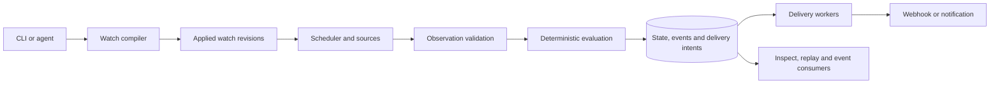

**Ding migration to a persistent watch runtime**

Implementation plan prepared October 8, 2026. The objective is to fix the audited defects, preserve useful components, and replace the workload-bound architecture with a small open source runtime for persistent watches. This plan specifies proposed behavior and implementation work; it does not mark any repair as completed.

Keep Go and the existing repository. Stabilize the current product, build the new runtime alongside it during development, then remove the old runtime from the new distribution. Preserve legacy releases and a maintenance branch so removing old architectural assumptions does not require silently changing existing users' behavior.

The [codebase audit](codebase-audit.md) and [reproduction tests](../../testdata/audit/reproduction_test.go.txt) are the defect baseline. The plan follows the persistent-watch direction from the current discussion, rather than earlier unrelated product proposals.

**1. Product boundary and first release**

Ding should own the repetitive mechanics of watching: acquire observations, evaluate explicit conditions, remember state, record evidence, and deliver events reliably. An agent can create and inspect watches or consume their events. Normal evaluation should require no model calls.

The first complete demonstration is an HTTP endpoint checked every five seconds. Three consecutive HTTP 5xx responses open an incident and enqueue one notification. Two subsequent healthy responses close it and enqueue a recovery notification. Restarting Ding preserves the incident. A destination returning 429 causes a scheduled retry, not a successful-delivery record. A recorded fixture reproduces the same transitions without network access.

The initial developer release includes HTTP/JSON polling, bounded local commands, and authenticated push ingestion; typed field comparisons, changes, consecutive matches, existing numeric window aggregates, and missing-observation deadlines; a durable local state store; generic webhooks and console output; watch management and replay. Port Slack and Discord payloads before beta. Preserve other inexpensive HTTP payload formats when their tests pass through the shared transport; they must not postpone the complete HTTP demonstration.

Defer consumer data catalogs, browser scraping, provider-specific sports/flight/traffic integrations, trading, hosted accounts, distributed execution, arbitrary action workflows, and a graphical dashboard. Add continuous streaming transports after the polling and push contracts work. Percent-change and semantic text conditions can follow with explicitly defined data requirements. The model interface must report unsupported requests rather than invent a source or silently approximate a condition.

The project succeeds only if a developer can use it more easily than maintaining an agent-generated script. Natural-language setup is an authoring convenience; reliable execution and useful integrations are the product.

**2. Architectural decisions**

| Decision | Proposed implementation |
| --- | --- |
| Deployable unit | One local Go daemon, one state directory, one writer owner; a CLI talks to that daemon. Support a container with a persistent volume. |
| Watch definition | Versioned YAML/JSON with a stable watch ID, source, condition, trigger policy, and destination references. Names are display metadata. |
| Applied configuration | YAML is the portable authoring format. Applying it creates an immutable revision in the database. The active database revision controls execution; changing a file alone does not change a running watch. Export reconstructs the applied definition. |
| Persistence | SQLite with migrations, transactions, backups, bounded history, and a durable outbox of pending deliveries. No optional correctness-critical snapshot mode in the new runtime. |
| Evaluation | Deterministic transitions computed from a plan, previous state, observations, and explicit logical time. No HTTP, shell execution, model calls, or ambient clock reads inside the evaluator. |
| Concurrency | Bounded acquisition and delivery workers. Serialize state transitions per watch; start with one database writer rather than multiple competing evaluators. |
| Delivery contract | Durable retry of committed delivery intents, stable event IDs, explicit terminal failures. Remote receipt can be duplicated after an ambiguous timeout; do not promise universal exactly-once delivery. |
| Extension boundary | Go source/destination interfaces and bounded JSON command input/output first. A stable external plugin protocol can follow real adapter demand. |
| Agent interface | The same versioned schemas and structured CLI/API results used by humans. Begin with an agent skill/tool wrapper; add a thin MCP server after the contracts stabilize. |
| Language model dependency | None in the daemon. An agent translates natural language into a supported watch and uses Ding's validation and replay tools. |

SQLite's WAL mode permits concurrent readers but has a single writer and requires a local filesystem. Use WAL with `synchronous=FULL` for committed watch state and delivery intents, verify effective settings, and bound long readers/checkpoint growth. Treat `modernc.org/sqlite` as the initial driver candidate because it supports a CGo-free implementation; pin a maintained version only after checking its bundled SQLite fixes, supported release targets, dependency requirements, and resulting binary size. This is an implementation spike, not permission to weaken durability to hit a benchmark. [SQLite WAL](https://sqlite.org/wal.html), [synchronous settings](https://sqlite.org/pragma.html#pragma_synchronous), [Go driver documentation](https://pkg.go.dev/modernc.org/sqlite).

**3. Components and ownership**



The arrow into the database represents a transaction boundary, not a best-effort log write. The runtime must not update an in-memory state as authoritative and save it later. Any cache is updated only after the corresponding commit succeeds.

| Proposed package under `../../internal` | Responsibility and permitted dependencies |
| --- | --- |
| `watch` | Definition, observation, transition, event, identity, and revision types. No runtime I/O. |
| `plan` | Strict parsing, normalization, validation, compilation, capability checks, and state compatibility fingerprints. No goroutine or client startup. |
| `condition` | Reused numeric parsing and new typed predicates. Pure evaluation with explicit time. |
| `runtime` | Lifecycle, scheduling, bounded work queues, per-watch serialization, and transaction coordination. |
| `source` | HTTP, command, and push adapters. Fetch outside database transactions; return observations and checkpoints. |
| `store` | SQLite repositories, migrations, transactions, retention, backups, and leases. No notification transport. |
| `delivery` | Durable work claiming, retry policy, outcomes, payload rendering, and destination transports. No condition evaluation. |
| `api` | Authenticated local control and push ingestion; structured error responses. |
| `cli` | Argument parsing and presentation; reusable application services live outside Cobra commands. |

Keep boundaries small and introduce packages with their first caller. Do not create a generic workflow engine or an unused abstraction framework. During development, use a temporary `cmd/ding-watch` entry point to avoid changing the existing `ding` binary before the new behavior is ready.

**4. What to retain, extract, and delete**

| Existing asset or assumption | Action and removal condition |
| --- | --- |
| [JSON and Prometheus parsers](../../internal/ingester/json.go), jq support | Retain as adapters. Add context cancellation, output-count/size limits, strict timestamps, and typed projections. Do not force every observation into a single float. |
| [Numeric condition grammar](../../internal/evaluator/condition.go), templates, matching | Extract useful pure functions with their tests. Numerical grammar remains one supported condition form; add typed predicates beside it. |
| [Engine](../../internal/evaluator/engine.go) owning buffers, network guards, cooldowns, and process modes | Replace orchestration with explicit state transitions and runtime services. Delete the old engine after supported-rule replay parity and legacy release preservation. |
| HTTP guards executed during evaluation | Keep only in legacy mode. Conversion reports them as unsupported until a source-composition feature has defined freshness semantics. Never move hidden HTTP calls into the new evaluator. |
| `over run`, `end-of-run`, synthetic process exit rules | Keep in the legacy release. New monitoring is watch-lifetime based. A completed command observation may include exit code and duration; it does not terminate Ding. |
| [Subprocess wrapper](../../internal/cli/run.go) and [run context](../../internal/runctx/runctx.go) | Reuse cancellation, output handling, and context helpers where useful. Remove implicit CI environment enrichment from the new evaluator. Do not retain `ding run` merely to keep the old identity. |
| Provider payload rendering | Extract into destination adapters with fixtures. Preserve compatible rendered fields; add stable event IDs and revision metadata to the new event envelope. |
| Repeated provider retry loops and [current dispatcher](../../internal/cli/dispatcher.go) | Replace with one outbox-backed delivery service. Remove queue ownership from each provider after outcome/retry parity tests. |
| [JSON snapshots](../../internal/evaluator/state.go) and periodic flushers | Repair their legacy behavior, then remove them from the new runtime. They are not the new system's durability mechanism. |
| Kubernetes Events, GitHub Actions annotations, GitLab artifacts, Buildkite annotations | Preserve in the legacy product; exclude from the new default binary. Generic events/webhooks are the initial integration path. Extract a separate adapter only when demand justifies it. |
| Kubernetes client dependency | Remove from the new executable graph once legacy notifier imports are separated. Remove from the main module at cutover if no remaining code uses it. |
| [BuildFromConfig](../../internal/server/server.go:94) | Split pure compilation from resource construction. Delete the side-effectful validation path after both legacy and new commands use the split. |
| Old `/reload` and duplicated SIGHUP logic | Consolidate in the legacy fix, then replace in the new control API with atomic application of a versioned definition. |
| Dry-run formatting, CLI framework, health metrics | Reuse with the new event type. Preserve test coverage for formatting and structured outputs. |
| Workload-specific recipes and marketing | Preserve versioned legacy docs. Rewrite the current quickstart around persistent watches and move recipes out of the default navigation at cutover. |

The legacy product remains available as a release and maintenance branch; it does not remain as a second permanent architecture inside the new daemon. The latest local tag observed is `v0.13.0`; verify published release/tag state before choosing actual release numbers. Use “watch alpha,” “watch beta,” and “watch stable” as milestones until then.

**5. Fix every audited defect before treating the old runtime as reliable**

| ID | Work and affected files | Acceptance evidence |
| --- | --- | --- |
| D01 | In [webhook.go](../../internal/notifier/webhook.go:169) and other HTTP notifiers, distinguish delivered, retryable, permanent failure, and exhausted outcomes. Retry 429 and documented transient responses; parse `Retry-After`. Never increment success for rejected delivery. | Table tests cover 2xx, 401, 403, 408, 429, 5xx, timeout, malformed provider response, and retry exhaustion. Audit 429 test passes. |
| D02 | Replace separate cooldown check/set in [engine.go](../../internal/evaluator/engine.go:171) with one atomic reservation using explicit evaluation time. | Synchronized concurrency regression produces one alert for one key during cooldown, while different keys proceed independently. |
| D03 | Use explicit logical time in [cooldown.go](../../internal/evaluator/cooldown.go:19), status rendering, and replay. | Two events two minutes apart with a one-minute cooldown fire twice; running the replay at different wall times produces the same result. |
| D04 | Replace delimiter concatenation in label, rule, and buffer identities with canonical structural encoding; distinguish missing, empty, and typed values. | Collision fixtures and fuzz/property tests cover punctuation, Unicode, empty values, map order, and distinct groups. |
| D05 | Version [legacy snapshots](../../internal/evaluator/state.go:74); include condition/state fingerprints and compatible buffer settings. Reset incompatible state explicitly and remove retired rules' state. | Restoring a one-hour window into a one-minute rule cannot retain the old semantics. Deleted/renamed/changed rules and corrupt or future-version snapshots have explicit outcomes. |
| D06 | Replace linear seen-label scans with a set; add idle eviction and global cardinality limits to [engine.go](../../internal/evaluator/engine.go:354). Evict expired cooldown entries and unused windows. | The stale-label observation becomes a bounded-retention assertion. Active windows and unexpired cooldowns remain intact. Quota exhaustion is visible. |
| D07 | Give daemon shutdown and reload one lifecycle implementation in [serve.go](../../internal/cli/serve.go) and [server.go](../../internal/server/server.go). Stop admissions, finish in-flight evaluation, drain delivery within a deadline, then close resources. | Concurrent ingest/reload/shutdown tests find no writes to stopped workers or orphaned goroutines. Drain either completes or explicitly reports the undelivered count on timeout. Legacy crash/deadline loss remains documented until the new durable store exists. |
| D08 | Split compilation from runtime construction in `BuildFromConfig`, [validate](../../internal/cli/validate.go), and [test-rule](../../internal/cli/test_rule.go). Move environment substitution after YAML decoding and validate unknown fields, duplicate names, negative sizes/durations, URLs, and references. | Validation and fixture replay run with network disabled, start no notifier workers, need no cluster credentials, and create no runtime files. Legacy guards in replay require fixtures or return an explicit unsupported error. |
| D09 | Add an explicit listen address and authentication to [serve.go](../../internal/cli/serve.go:133) and HTTP handlers. Use loopback by default; document the deliberate container/network configuration needed. | Unauthorized control/ingest calls fail. Remote binding needs an explicit address and credential configuration. Existing exposed-port recipes are updated. |
| D10 | Fix [benchmark timestamps](../../benchmarks/go/bench_test.go:64), assert retained sample counts, and add populated-window/cardinality/delivery scenarios. | The warmup retains its stated 1,000 samples. Benchmarks separate parsing, evaluation, persistence, and network delivery; unsupported README numbers are removed. |
| D11 | Add CA roots to both [Dockerfiles](../../Dockerfile.release), align the builder with the supported Go version, fix Homebrew's version command and license, and measure binary size. | Container HTTPS smoke test succeeds with trust verification enabled; release artifacts execute their advertised version command; license metadata matches Apache-2.0. |
| D12 | Add a pull-request test workflow alongside [release.yml](../../.github/workflows/release.yml). | Unit/integration tests, Linux race tests, vet, release-target builds, and a container smoke test gate the relevant changes before tags. |

Promote each reproduction into the normal suite with its corresponding fix. Do not make the first CI change a knowingly failing branch. Prefer deterministic regressions over stress loops; retain concurrency stress as an additional check.

Legacy snapshots do not contain enough information to reconstruct every original label map or prove compatibility with the current rule. Preserve them as backups. Do not claim lossless migration of ambiguous keys. Startup must diagnose unsupported state and require an explicit reset or validated migration path; a logged silent reset is not sufficient.

**6. Watch definition and public interface**

The following is proposed syntax, to be implemented and schema-tested in the watch-contract milestone:

```yaml
apiVersion: ding.ing/v1alpha1
kind: Watch
metadata:
  id: api-health
  name: API health
spec:
  source:
    type: http
    url: https://api.example.com/health
    every: 5s
    timeout: 2s
  condition:
    field: http.status
    operator: gte
    value: 500
  policy:
    trigger: transition
    consecutive: 3
    recoverAfter: 2
    onUnknown: hold-incident
  destinations:
    - ref: ops-webhook
      events: [firing, recovered]
```

A destination definition holds the nonsecret delivery configuration and secret references, for example an environment-variable reference for a webhook URL. Secret references are resolved only by the I/O layer. Compilation checks their shape without fetching credentials. Do not interpolate arbitrary secret text into raw YAML or store resolved tokens in event history.

HTTP adapters expose transport status and explicitly selected JSON fields. Missing, malformed, or wrong-type fields yield an unknown result, not zero or false. A timeout is a source-health failure; it is not silently converted to HTTP 500. The example therefore counts actual HTTP 5xx responses. Separate source-health events make timeouts visible.

| Proposed command | Contract |
| --- | --- |
| `ding daemon --state-dir ...` | Own the store and run applied watches until stopped. Refuse a second writer for the same directory. |
| `ding validate watch.yaml --json` | Pure schema and capability validation. No live source requests or credential lookup. |
| `ding apply watch.yaml --dry-run --json` | Explain the revision diff, execution permissions, and which state would be preserved or reset. No runtime changes. |
| `ding apply watch.yaml` | Atomically create or update the watch and start it. Support expected-revision checks to avoid overwriting another editor. |
| `ding watch list / inspect / pause / resume / delete` | Manage lifecycle through the same application API; support structured output. |
| `ding test watch.yaml --events fixture.jsonl --json` | Run an isolated deterministic replay with recorded time and injected source results. No delivery or production DB access. |
| `ding events --watch api-health --follow --json` | Read a resumable event stream with IDs/cursors. Report expired cursors explicitly. |
| `ding export --watch api-health` | Export the applied definition with secret references, never resolved credentials. |
| `ding migrate --config old.yaml --out watches/` | Convert supported legacy rules and produce a per-rule migration report. Does not start watches. |
| `ding doctor --json` | Report store, worker, source, quota, credential-reference, and delivery health without leaking secrets. |
| `ding backup --out ...` | Produce a consistent backup using the store's supported backup mechanism. |

CLI responses use versioned envelopes and stable error codes. Human text is presentation, not something agents must scrape. During alpha the temporary binary is `ding-watch`; documentation must distinguish proposed commands from commands available in a shipped release.

**7. State, time, and trigger semantics**

- A watch ID identifies the user's watch; an immutable revision identifies its configuration. Entity identity comes from explicit grouping fields, not every incidental label. Source cursor, incident state, cooldown, and delivery identity each have separate keys.
- Default first-release windows use accepted observation time. Store source-observed time separately for evidence. Replays use recorded accepted times and sequence numbers. Do not silently switch to provider event time; lateness-aware event-time windows are a separate feature.
- All evaluation gets a logical timestamp as an argument. Live timers use an injected clock; timer firings become replayable inputs. Detect clock discontinuities, prevent negative elapsed durations, and mark affected continuity checks unknown instead of inventing elapsed evidence.
- `transition` opens an incident after the specified count and fires once until recovery. `level` can fire repeatedly at a configured interval. The legacy converter uses level/cooldown semantics where needed; it never silently turns repeated alerts into transition-only alerts.
- Separate incident state from source health. Unknown input resets a pending consecutive streak but does not close an open incident. Recovery requires the configured number of fresh nonmatching observations. Resume/restart after a sampling gap preserves open incidents and resets unsupported streak continuity.
- Missing-data deadlines use persisted timers and can fire even when no new observation arrives. Duration conditions require an explicit freshness bound; silence cannot prove a condition remained true.
- `change` establishes a baseline on the first valid observation and emits on subsequent typed-value changes. New-event conditions require stable provider IDs and a bounded, declared deduplication horizon. Equal values from different polls are separate observations, not duplicates.
- Define rolling windows as `(now - window, now]`. If a configured sample or storage budget prevents exact evaluation, emit a degraded/unknown result. Do not silently turn a one-hour rule into “the most recent 10,000 values.”
- State fingerprints include source interpretation, grouping, condition, and temporal policy. Display-name/message-only changes preserve compatible state. Source/condition changes reset incompatible state with a recorded reason. Destination-only changes affect future events; already queued deliveries keep their original destination revision.
- Applying a definition serializes against evaluation. Results acquired for a replaced generation are discarded with an explicit stale-generation outcome; they cannot mutate the new revision's state. Failed application leaves the prior revision running.

**8. Transaction and crash behavior**

Use tables for applied watch revisions, runtime lifecycle, source schedules/checkpoints, bounded observations, entity state/window data, durable timers, emitted events, destinations, delivery intents, delivery attempts, and migration metadata. Retain definitions referenced by active state or queued deliveries.

For each observation batch, validate and fetch outside the transaction, then serialize by watch. In one database transaction, deduplicate by the source's identity contract, persist accepted observations, update source checkpoints and condition state, create resulting events, and enqueue one delivery intent per destination. Commit before acknowledging push ingestion or publishing new in-memory state. A replayable source cursor cannot advance beyond the observations stored in that transaction.

For polling, a persisted poll identity distinguishes retried execution of one scheduled poll from a new poll with the same value. Push producers may supply an idempotency key; without one, each accepted request is a new input. Bound and document deduplication retention. Do not advertise unlimited historical deduplication.

| Failure point | Required behavior |
| --- | --- |
| Before observation transaction commits | No accepted-input acknowledgment, state transition, or delivery intent. Cursor does not advance. |
| After commit, before delivery begins | Pending delivery remains discoverable after restart. |
| Worker crashes after claiming work | Lease expires; another worker can retry without changing the event ID. |
| Receiver accepts, but Ding crashes before recording success | Retry may duplicate receipt; stable event ID and destination-supported idempotency help the receiver deduplicate. |
| Disk full, read-only filesystem, or commit failure | Do not acknowledge new input as durable. Pause affected acquisitions, expose unhealthy status, and reject push with a retryable response. |
| Migration fails | Transaction rolls back or startup refuses the incompatible store. Preserve a verified backup; never start with a silently empty database. |

Database migration rollback is different from rolling back a watch revision. Back up before a schema upgrade, refuse newer schemas on old binaries, and make restore a deliberate offline procedure. A copied `.db` file without its live WAL is not an adequate backup strategy.

**9. Delivery, resource bounds, and lifecycle**

Provider adapters render and send one attempt; they do not own queues or retry loops. Every attempt returns a typed outcome, optional provider retry deadline, and redacted diagnostic information. Generic HTTP delivery accepts only the declared successful statuses; provider-specific adapters also validate response bodies where necessary. Do not follow delivery redirects by default.

Start with bounded exponential retry and jitter, honoring `Retry-After` rather than retrying sooner. Proposed defaults are eight attempts over at most 24 hours. A longer provider delay becomes a visible terminal/parked outcome under that policy. Permanent failures, exhaustion, missing credentials, and cancellations remain inspectable and manually retryable. No failed outcome increments the success counter.

Dispatch independently across destinations. Maintain event order for each watch/destination pair so recovery cannot overtake its firing event, while allowing other watches to proceed. Apply per-destination backoff and a global concurrency budget. Store immutable event payloads and destination revisions; resolve current values of their configured secret references at send time.

Bound watch count, entity cardinality, observations, payload size, transform output, concurrent requests, timers, outbox rows, and database size. Use maps/sets for membership and indexed expiry for cleanup. Evict only state that is no longer needed by an active window, cooldown, incident, or delivery. Idle open incidents require a visible expiration policy, not silent deletion.

Proposed operational defaults: 1 MiB input/response and transform-output limits; 100 transformed observations per fetch; 32 concurrent acquisitions; 8 concurrent deliveries; 7 days of ordinary event history; 10,000 pending deliveries; 1 GiB store budget. Confirm these against the capacity fixture before beta. History limits never delete active window data, pending deliveries, or required evidence; reaching a hard budget applies backpressure and marks affected watches degraded. Data that changes while polling is paused cannot be reconstructed unless the source supports replay, so show the resulting gap.

Pause stops acquisition and condition timers, preserves open incidents, and lets already committed deliveries finish. Resume records the gap and resets incomplete continuity checks. Delete stops future work and retains event history; pending deliveries continue unless the caller explicitly chooses cancellation. Shutdown stops admission and acquisition, commits in-flight state, attempts bounded delivery drain, then closes the database; unfinished durable deliveries resume next start.

**10. Source and local access boundaries**

HTTP sources support configurable interval, timeout, response limit, auth references, conditional requests, and provider backoff. A 304 supplies no newly parsed sample; explicitly define whether the adapter emits an unchanged observation, and do not count repeated cached data as independent failure evidence by accident. Initial default: no new condition sample on 304, with freshness tracked separately.

Scheduled work never overlaps for the same source. After downtime, perform one catch-up poll and record missed intervals rather than replaying a burst of fictitious historical checks. Run slow I/O outside evaluator/store locks. Enforce transform cancellation and output limits, including jq programs that could otherwise run indefinitely or yield unbounded output.

Command sources execute an explicit argv with an explicit working directory, timeout, output bounds, and environment allowlist. They are local trusted configuration; they run with the daemon user's permissions and are not sandboxed. Document that sources should be read-only or safely repeatable. Do not invoke an implicit shell or turn arbitrary ingested text into an executable command. Handle process-tree termination and platform differences in adapter tests.

The local control API binds loopback and uses a generated token protected by OS file permissions. Keep administration and push-ingest credentials separate. Remote binding requires explicit configuration and a documented TLS/proxy setup. Local watches may intentionally access private services; a future hosted service needs a separate network-access policy before it accepts arbitrary customer URLs.

Keep selected observation fields rather than raw response bodies by default. Redact tokens, authorization headers, secret-bearing URLs, and provider response details from logs and exports. Agent-visible source content is data, not authorization to change watches or run commands.

**11. Implementation sequence and reviewable changes**

Each change must include relevant tests and a working CLI or library demonstration. Dependencies define order; unrelated work may proceed independently without requiring a new organizational structure or a large merge.

| Change | Depends on | Concrete deliverable and completion gate |
| --- | --- | --- |
| P01 Baseline and CI | None | Record current behavior and release targets; add PR checks; organize audit fixtures. Existing suite remains green. |
| P02 Time and identity repairs | P01 | D02–D04 fixed with deterministic replay, atomic cooldown, and canonical identity tests. |
| P03 Legacy state and limits | P02 | D05–D06 fixed; explicit incompatible-state handling; bounded label-retention tests. |
| P04 Delivery outcomes and lifecycle | P01 | D01 and D07 fixed across existing providers; reload and shutdown share one lifecycle. Export reusable outcome classification for the new transport. |
| P05 Compilation, access, packaging | P01 | D08–D12 fixed; offline validation; auth/bind defaults; corrected benchmarks; CA-enabled containers; tested release metadata. Publish a hardened legacy release after P02–P05 pass. |
| P06 Watch contract and compiler | P02, P05 | Versioned schema, pure compiler, explicit identities/revisions, CLI output contracts, and example manifests. New temporary binary can validate and explain a watch. |
| P07 Store and transactional state | P06 | Driver/build spike, schema migrations, writer lock, transaction API, backups, immutable revisions, event/outbox tables, and crash fixtures. |
| P08 Deterministic watch evaluation | P06 | Extract numeric grammar and payload-independent types; implement comparisons, transition/level policy, consecutive/recovery semantics, unknown state, and fixture replay. |
| P09 Complete HTTP watch | P04, P07, P08 | Scheduler, HTTP adapter, apply/inspect, transactional observation-to-event path, shared webhook worker, and restart-safe outbox. Pass the five-second demonstration. |
| P10 Lifecycle, bounds, and timers | P03, P09 | Revision fencing, pause/resume/delete, expiry, quotas/backpressure, missing-data timers, recovery after sampling gaps, and concurrent reload/shutdown tests. |
| P11 Remaining initial adapters | P05, P10 | Command and authenticated push sources; bounded jq projections; change/new-event conditions; Slack/Discord payloads on shared delivery. Adapter contract tests pass. |
| P12 Inspection and agent use | P10, P11 | Event cursors, replay evidence, doctor/export, documented JSON contracts, and a thin skill/tool wrapper. Demonstrate natural language to inspectable watch using existing schema capabilities. |
| P13 Migration and architectural deletion | P11, P12 | Config converter, explicit unsupported-rule report, supported-rule parity fixtures, legacy maintenance branch/release, and removal of old runtime/dependencies from the new main binary. |
| P14 Release qualification and docs | P13 | Fault matrix, soak, artifact builds, backup/restore drill, actual size/performance report, new quickstart, legacy docs, and watch beta/stable release checklist. |

P06–P08 can develop beside the old CLI once their direct dependencies are satisfied. P09 is the first product milestone: do not wait for a broad integration catalog or complete legacy deletion to demonstrate the new value. P13 follows migration tests; deleting old code earlier would discard the behavior oracle needed to verify conversion.

**12. Release gates and test strategy**

| Gate | Required proof |
| --- | --- |
| Hardened legacy | D01–D12 have tests or documented packaging verification; audit reproductions pass; current rule fixtures retain intended semantics; release changes are documented. |
| Watch alpha | Apply an HTTP watch, inspect it, trigger once, recover, retry a rate-limited webhook, restart mid-incident, and replay recorded inputs with identical event semantics. All committed but unfinished delivery work survives restart. |
| Watch beta | Command/push adapters, strict schema, concurrent lifecycle handling, bounded retention, backup/restore, source-health reporting, provider tests, and agent authoring demonstration work. |
| Watch stable | Migration report and legacy path are usable; fault/soak/build gates pass; quickstart starts from a fresh installation; published claims match measurements. |

Test pure transitions with an injected clock and fixtures, including boundary times, stale/missing values, reset behavior, and reordered input. Test each source through a reusable adapter contract. Test provider outcomes with local servers and response fixtures. Test persistence with subprocess termination around transaction/claim/acknowledgment boundaries, not only mocked repository methods. Verify no duplicate logical events for retried inputs while permitting duplicate remote receipts after ambiguous delivery.

Include SQLite disk-full/read-only tests, failed migration rollback, same-directory second-daemon rejection, credential rotation, 429 handling, slow destinations, process-tree cancellation, restart with expired leases, and concurrent apply/ingest/shutdown. Use race tests to find data races and separate assertions to find logical races.

Use a 24-hour fixture with 100 HTTP watches at five-second intervals, plus 30-second bursts of 200 pushed observations per second. Initial qualification targets on a documented four-core machine are under 250 MiB RSS, less than 10% memory growth after warmup, and p95 under 100 ms from accepted input to committed event under steady load, excluding source and destination network latency. These are provisional engineering targets; profile failures and revise the published capacity claim rather than weakening correctness. Record disk growth and cleanup stabilization as well as memory.

Build and smoke-test the OS/architecture targets actually advertised. The current release configuration lists Linux, macOS, and Windows on amd64/arm64; verify SQLite and command-process support for each before continuing that promise. Measure the stripped executable and container. Keep a size budget based on the new baseline rather than reusing the unsupported 5 MB claim.

**13. Compatibility and rollback**

During development the existing CLI remains the default and the new binary is explicitly experimental. Publish a hardened legacy release before switching defaults. At cutover the new watch binary becomes `ding`; old `run` and legacy `serve` are not silently reinterpreted. Recognize removed commands/configuration and give a specific migration or legacy-install instruction.

The converter translates supported numeric conditions, selectors, messages, destinations, and cooldown policies. It reports every unsupported feature, especially run-lifetime aggregation, end-of-run hooks, live HTTP guards, and CI-specific output. It must not emit a partially converted watch as ready to run. Configuration conversion starts new watch state; legacy snapshot import is not promised. Show the potential baseline/cooldown reset in the migration report.

Support configuration rollback by reapplying a saved revision through the same compatibility rules. Preserve queued deliveries and their original destination revisions. For binary/schema rollback, stop the daemon and restore a compatible verified backup; do not run an old binary against a newer schema.

Keep the legacy installer/versioned documentation available. Proposed maintenance policy: critical reliability and security fixes for 90 days after the first stable watch release, with old artifacts remaining available afterward. Set actual release versions and dates only when release readiness is known. The main quickstart and package description switch together with the binary so installations and documentation describe the same product.

**14. Work boundaries, effort, and first implementation step**

The repository currently has unrelated website/docs changes. Preserve them. Implementation should use a suitable isolated checkout or account for those changes before branching; never clean or reset the shared tree to satisfy a plan template. Use the repository's `codex/` prefix for new working branches. No branch, release, or implementation change is made by this planning document.

Planning allowance for one experienced engineer with agent assistance: roughly 30–50 focused engineering days for hardening, the first complete watch runtime, migration, and qualification. This is a scope estimate, not a delivery commitment. The largest uncertainties are extracting compatible semantics, fault testing, cross-platform SQLite/process behavior, and migration requirements. Re-estimate after P05 and P09 using completed work. Exclude hosted service development and consumer data partnerships from that estimate.

Start with P01, then P02: establish CI and the behavioral baseline, promote the clock/identity/cooldown reproductions, and make those pass. Prepare P04 and P05 as separate reviewable changes. The first acceptance checkpoint is a hardened existing binary; the next is the complete HTTP watch with transactional state and durable notification retry.

This plan intentionally gives the new runtime a small initial job. Expansion should follow evidence that developers prefer it to their existing scripts, and that its state and delivery guarantees hold under the failure tests above.
