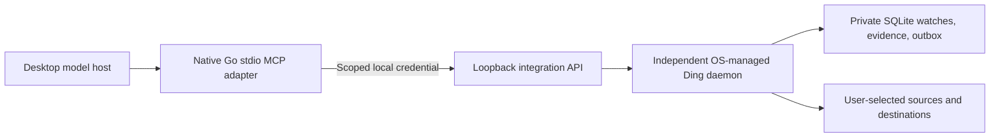

# Desktop-only publisher preflight package

Status: prepared in source, October 10, 2026. No inquiry or submission sent. No
public-directory eligibility or native signing claim is implied.

## Architecture and data boundaries

The adapter sends requested tool results and selected evidence to the model host.
The daemon does not send watches or telemetry to Ding Labs. Source checks and
notifications contact endpoints configured by the user. Update checks, when
configured, contact the official release source; they are independent of account
creation. Local monitoring continues when the model host closes. There is no
public relay back to the laptop.

## Review inventory

- [Tool/API contract](api.md): inspection, manifest verification, exact previews,
  reviewed apply, lifecycle, evidence, and delivery retry.
- [Privacy boundaries](privacy.md): credential handling, hostile source content,
  selected evidence, revocation, and command permissions.
- [Qualification evidence](verification.md): official independent SDK clients,
  scoped mutation rejection, stale reviews, restart-safe receipts, transport/UI
  fallback, and native artifact tests.
- [Local installation](../operate/local-setup.md): separately managed daemon,
  account-free first watch, credential backend, status, update, and removal.
- [Publisher inquiry and decision matrix](../development/desktop-marketplace-plan.md):
  exact questions, permitted-route evidence, and submission gates.

Two proposals are ready for publisher review: approved packaging of the adapter
with an accepted service-setup action, or pairing with a separately installed
signed Ding package. Neither uses plugin lifecycle hooks. The existing ChatGPT
portable manifest is a packaging input, not proof that bundled local stdio is
accepted. Do not invent local executable fields before the permitted route is
confirmed.

## First-use storyboard and synthetic review

1. Discover the listing on the web or supported desktop surface. State platform
   limits; do not imply a browser can launch a local executable.
2. Install using the publisher-approved route. Explain user-login startup and
   local execution before the user enables the background service.
3. Open Console and create an HTTP watch against the reviewer's own local fixture.
   Preview, request notification permission, send a labeled test, and confirm it.
4. Pair the adapter with a conservative grant. Preview a change from the host;
   apply only after approval. No copied bearer token appears in the conversation.
5. Close the client; verify a new observation and delivery. Reopen and inspect it.
6. Deny notification permission, stop/restart Ding, revoke the grant, and try a
   stale review. Each state must have an actionable explanation.
7. Update the daemon separately from the adapter. Remove the adapter; confirm
   watches remain. Remove startup registration; confirm the database remains.

Record package SHA-256, repository commit, native signing result, OS/architecture,
host surface/version, screenshots, and expected/actual results. Use `ding demo`
for a disposable alert-pipeline recording; use the account-free first-watch
journey for activation evidence. Never include production credentials or real
user watch contents in the reviewer bundle.

## Surface qualification matrix

| Surface | Documentation category | Ding actual-host test | Public approval |
| --- | --- | --- | --- |
| ChatGPT ordinary desktop chat | Requires publisher confirmation | Pending | Unresolved |
| ChatGPT Work desktop | Requires publisher confirmation | Pending | Unresolved |
| Codex desktop | Local developer integration is a separate test | Pending | Unresolved |
| Web discovery | Desktop-only discovery documented | Pending | Unresolved |
| Browser execution | Cannot assume local process access | Not claimed | Not claimed |
| Mobile | Requires explicit support evidence | Not claimed | Not claimed |

Claude remains a separate packaging and host-qualification track. A successful
private or developer installation does not establish either public listing.
